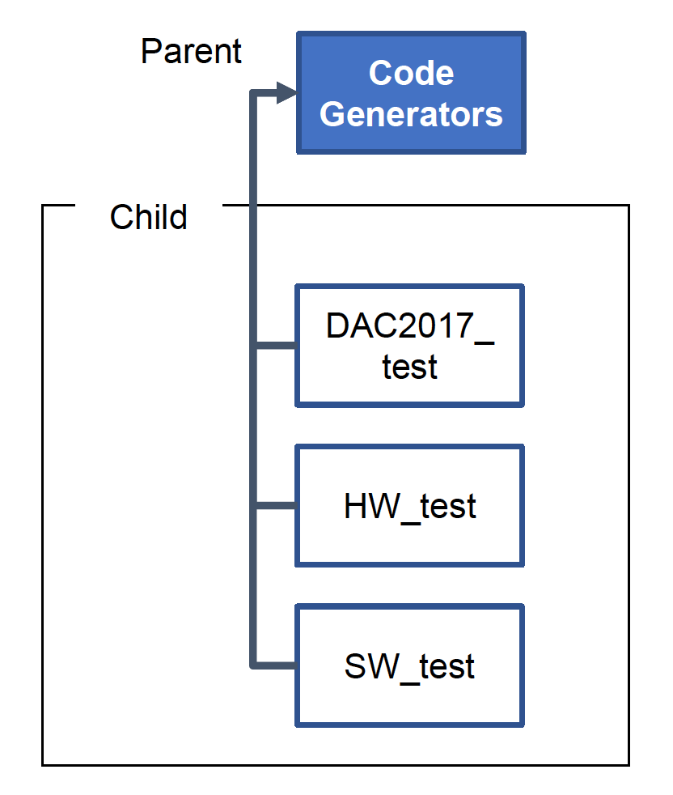
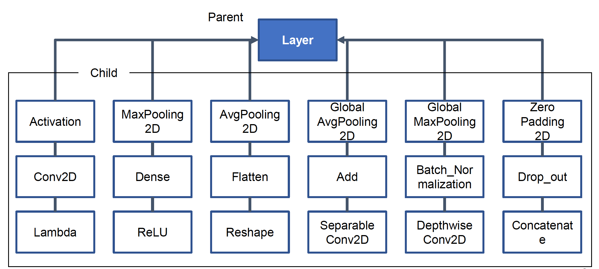
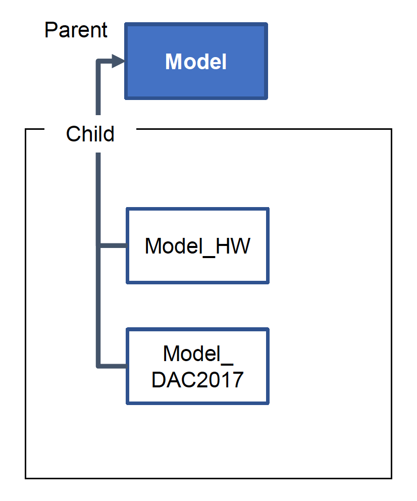

In each folder, 

### CodeGenerators  

### Keras_Verification  

Calculate output values of each layer by Keras

### Layers  

  

### Models  

### Template  

Template files classified by 4 directories  
(Function, Init, Main, Print)

