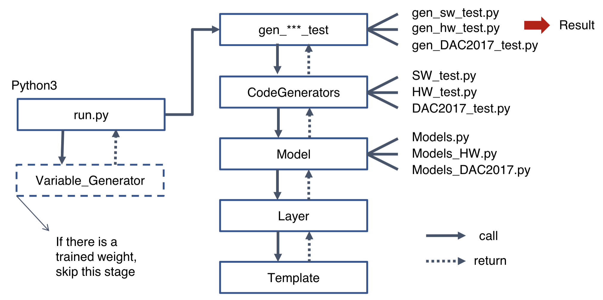

# Development of C programs for Convolutional Neural Network Accelerators

### Purpose
Creating a new toolkit for people who are using fpga.   

### Prerequisites
* python 2.7
* tensorflow
* keras(2.2)
* numpy

### System structure

  

### Usage

#### Download the repository

```
git clone "git@github.com:Hamidu68/ML-acceleration.git"
```

#### Run run.py

in ML-acceleration folder, 
use the command below to run run.py and parameters should be passed.   
```
python run.py <SW_test> <HW_test> <DAC2017_test> <Test_file> <model_name> <data_type>
```
SW_test : generate software code(c code of the model, {model_name}.cpp file) or not (True/False)  
HW_test : generate hardware code(optimized code, {model_name}.cpp file & {model_name}_test.cpp file) or not (True/False)  
DAC2017_test : generate DAC2017 code or not (True/False)  //it will be removed  
Test_file : name of the test file which contains layer information of the model (ex. vgg19_test.csv)  
model_name : name of the model(network) ex. vgg19, resnet50    
data_type : data type (int, unsinged int, float, ap_uint<16>)  

 
 ### Ongoing work
 1. code revision - structure/hareware code generator   
 2. add new models(architecture)   
 3. apply quantization/weight prunning  
