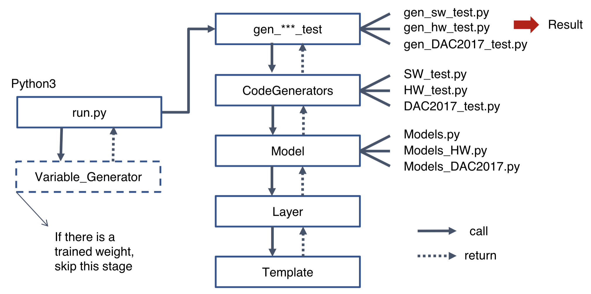

# Development of C programs for Convolutional Neural Network Accelerators

### Purpose
Creating a new toolkit for people who are using fpga.   

### Prerequisites
* python 2.7
* tensorflow
* keras(2.2)
* numpy

### System structure  
* [model_info](./model_info)  
* [src](./src)  
* [output](./output)  
* [training](./training)  
* [other](./other)  

  

  

### Usage

#### 1. Download the repository

```
git clone "git@github.com:Hamidu68/ML-acceleration.git"
```

#### 2. Set condition

in ML-acceleration/config.json file, change the value of various keys.  
```
{
  "model": "vgg19",
  "extract_configs": "False",
  "model_info": "./model_info/vgg19_test1.csv",
  "sw_test": "False",
  "vivado_test": "True",
  "use_trained_weight": "False",
  "data_type": "int",
  "random_range": "5",
  "batch": "False",
  "weight_file_path": "./variables/init_weight.bin",
  "input_file_path": "./variables/init_input.bin",
  "trained_weight_file_path": "./variables/vgg19_weights.bin",
  "image_file_path": "./variables/image.bin",
  "output_path": "./output/",
  "template_path": "src/model/template/"
}
```  
* model : name of the model(network) (ex.vgg19, resnet50)  
* extract_configs : if you don't have layer information of the model(True, False)  
* model_info : location of layer information (ex."./model_info/vgg19.csv")   
* sw_test : keras and c code test(True/False)   
* vivado_test : generate code for Vivado HLS (True/False)   
* use_trained_weight : if you don't need variable generator (True/False)   
&nbsp;&nbsp;&nbsp;&nbsp;&nbsp;&nbsp;&nbsp;&nbsp;&nbsp;&nbsp;&nbsp;&nbsp;&nbsp;&nbsp;&nbsp;&nbsp;&nbsp;&nbsp;&nbsp;&nbsp;&nbsp;&nbsp;&nbsp;&nbsp;&nbsp;&nbsp;&nbsp;&nbsp;&nbsp;&nbsp;&nbsp;&nbsp;&nbsp;&nbsp;&nbsp;
* data_type : data type (int, unsinged int, float, ap_uint<16>)   
* random_range : number of range that will be used to variable generator  
&nbsp;&nbsp;&nbsp;&nbsp;&nbsp;&nbsp;&nbsp;&nbsp;&nbsp;&nbsp;&nbsp;&nbsp;&nbsp;&nbsp;&nbsp;&nbsp;&nbsp;&nbsp;&nbsp;&nbsp;&nbsp;&nbsp;&nbsp;&nbsp;&nbsp;&nbsp;&nbsp;(ex. 5 means input.bin, weight.bin files consist of value between 1 to 5)     
* batch : batch layer or not (True/False)   
* weight_file_path : location of weight file ("./variables/init_weight.bin")   
* input_file_path : location of input file ("./variables/init_input.bin")   
* trained_weight_file_path : location of trained weight file ("./variables/vgg19_weights.bin")   
* image_file_path : location of image input file ("./variables/image.bin.bin")   
* output_path : output path ("./output/")   
* template_path : template path ("src/model/template/")   


#### 3. Run run.sh

in ML-acceleration folder, 
use the command below to run run.sh script file.   
```
./run.sh
```  
in run.sh file,  
```  
python main.py  
```  

script file 'run.sh' will run main.py file.

 ### Ongoing work
 1. add new models(architecture)   
 2. apply quantization/weight prunning  
