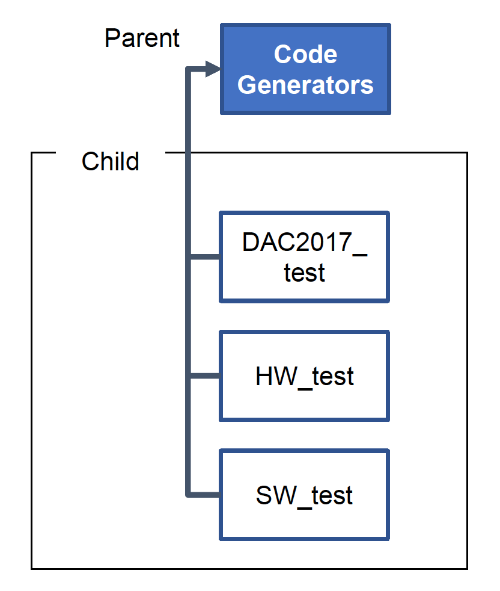
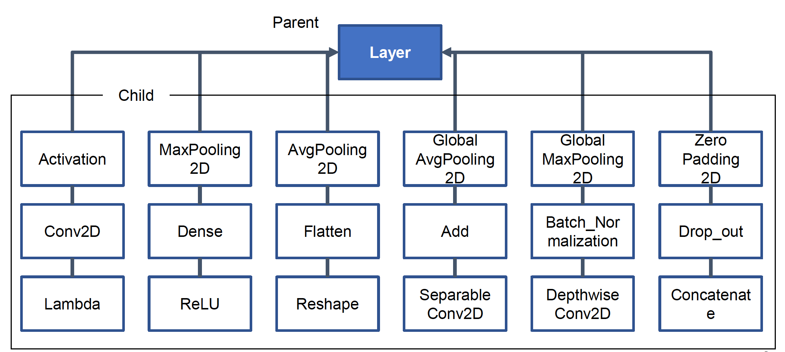
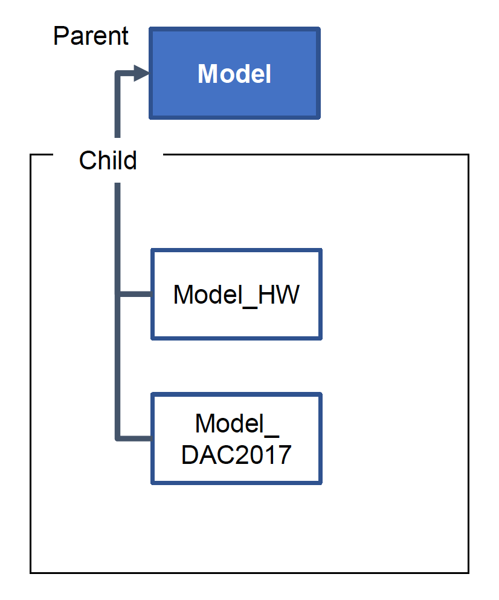

### Code generator for c, keras and optimized one.  

In each folder, 

#### CodeGenerators  

#### Keras_Verification  

Calculate output values of each layer by Keras

#### Layers  

  

#### Models  

#### Template  

Template files classified by 4 directories  
(Function, Init, Main, Print)

In each file,  

#### gen_sw_test.py  
compile and run function to generate c file, compare outputs between c and keras using vimdiff  
and check maximum error range using check_maximum_error function defined in maximum_error.py (in same folder)  

#### maximum_error.py  
check maximum error range by comparing each value of c nd keras and  
print the maximum value of the difference of each element divided by the element of keras.  
